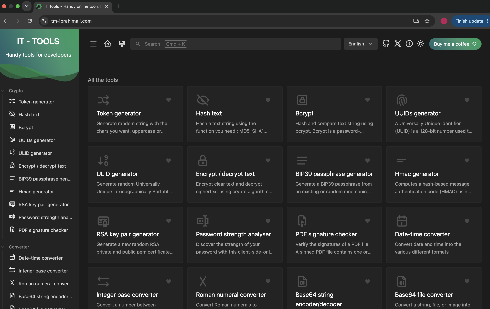
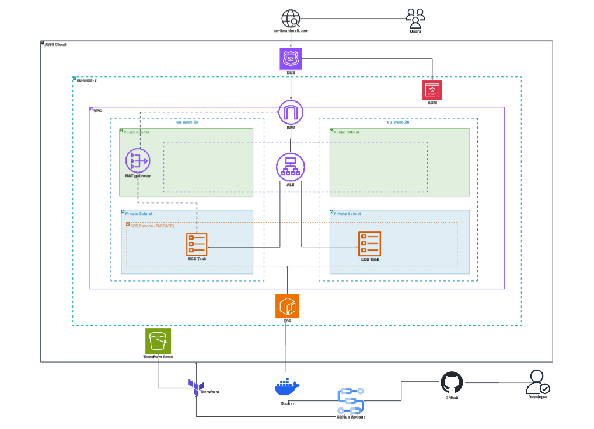
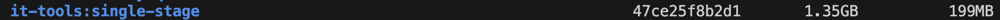
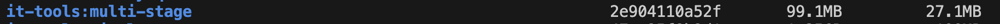
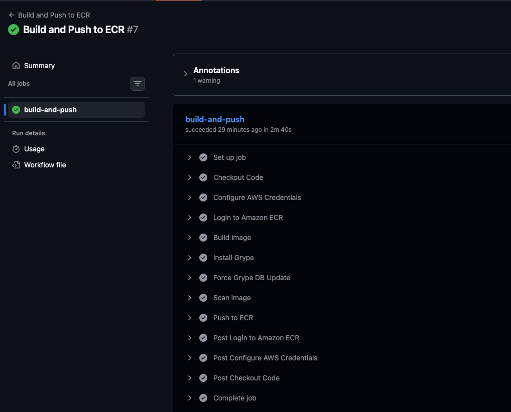
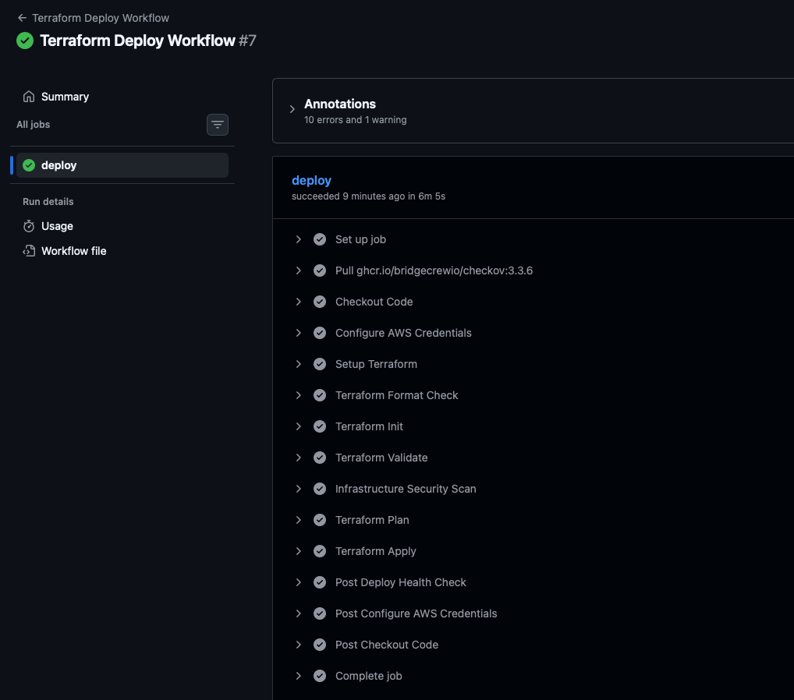
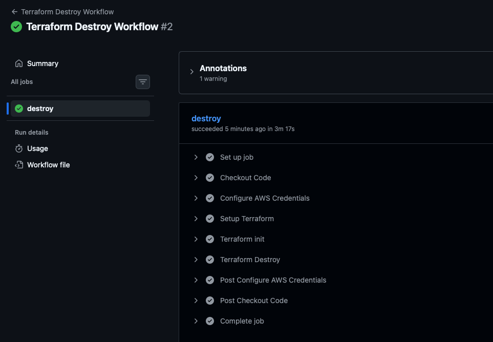

# Automated Infrastructure Deployment on Amazon ECS 

## Project Overview

This project deploys a containerised IT Tools application to Amazon ECS Fargate using Terraform for Infrastructure as Code (IaC). The solution utilises GitHub Actions for CI/CD, Amazon ECR for container image storage, Route 53 for DNS management, and AWS Certificate Manager for HTTPS encryption. The infrastructure is designed using secure Multi-AZ architecture with public and private subnets.

---

## Application URL
→ https://tm-ibrahimali.com



---

## Local Setup

```
pnpm install        # Project Setup

pnpm dev            # Compile and Hot-Reload for Development

pnpm build          # Type-Check, Compile and Minify for Production

curl http://localhost:5173/health   # Local setup health check

```

## Architecture Diagram


---

## Features
- Infrastructure provisioned using **Terraform**
- Remote Terraform state stored in **Amazon S3 Bucket**
- Custom **VPC** with two Public and Private Subnets spanning Multiple Availability Zones
- Container image build, vulnerability scanning, and storage using **Amazon ECR**
- **ECS Fargate Service** behind ALB and HTTPS enabled using **AWS Certificate Manager (ACM)**
- Custom Domain configured using **Route53**
- Automated Container image build/push and deployment using **GitHub Actions**
- **GitHub Actions** authentication using **AWS OIDC** (no long-lived AWS credentials)

---

## Repository Structure
```
.
├──.github/
│    └── workflows/
│        ├── build.yml
│        ├── deploy.yml
│        └── destroy.yml
├── app/
│   ├── Dockerfile
│   ├── nginx.conf
│   └── app source code
│
├── bootstrap/
│   ├── ecr.tf
│   ├── main.tf
│   ├── output.tf
│   └── provider.tf
│
├── infra/
│   ├── main.tf
│   ├── provider.tf
│   ├── variable.tf
│   └── modules/
│       ├── acm/
│       ├── alb/
│       ├── ecs/
│       └── vpc/
├── .gitignore
└── README.md
```

---

## Key Components

### Dockerfile
- Implemented **non-root** user access to limit root access and enhance security
- Introduced **multi-stage Dockerfile**, reducing image size by **86%**
    - Before multi-stage build:
    
    - After multi-stage build:
    

### Infrastructure
- **VPC (Virtual Private Network)** - Provides secure network isolation for all AWS resources
- **Public Subnets** - Hosts internet-facing resources, such as **ALB** and **NAT Gateway**
- **Private Subnets** - Hosts **ECS Fargate Tasks**, preventing direct access from the internet
- **Internet Gateway** - Enables communication between public AWS resources and the internet
- **NAT Gateway** - Enables resources within private subnets to initiate outbound internet access while blocking direct inbound access from the internet
- **ALB (Application Load Balancer)** - Distributes incoming traffic evenly across **ECS Tasks** and handles HTTPS traffic using **ACM certificate**.
- **ECS Fargate** - Serverless compute engine running the containerised application 
- **Amazon ECR** - Stores container image used by **ECS service**
- **Route 53** - Provides **DNS management** and routes traffic from custom domain to **ALB**
- **ACM (AWS Certificate Manager)** - Manages SSL/TLS certificates needed to enable **HTTPS** encryption for secure application traffic
- **S3 Backend** - Stores Terraform remote state with native state locking enabled

### Workflows
- **GitHub Actions** - Continuous Integration and Continuous Delivery **(CI/CD)** platform used to automate container builds, infrastructure deployments, and resource teardown
    - **Build and Push Workflow** - Builds image for the app, runs a security scan for CVEs using Grype, and pushes image to ECR
    - **Terraform Deploy Workflow** - Initialise, Plan and Apply infrastructure. Post deploy health check completed after all resources are provisioned
    - **Terraform Destroy Workflow** - Safely removes all resources managed by Terraform when no longer needed  

### Security
- **IAM Roles** - Permissions follow the principle of least privilege, granting only the access required for GitHub Actions and ECS operations  
- **GitHub OIDC Authentication** - Allows GitHub Actions to securely assume **IAM roles** without storing any long-term AWS credentials
- **Grype** - Performs container vulnerability scanning before pushing image to **ECR** within CI/CD pipeline

---

## CI/CD Pipelines

### 1) Build and Push to ECR



### 2) Deploy and Post Health Check



### 3) Destroy Infrastructure


---

## Lessons Learned
- **GitHub OIDC Authentication** - Initially, I considered using AWS access keys within my GitHub Actions. After researching authentication methods, I implemented OIDC instead, as it provides a more secure approach by assuming an IAM role using temporary credentials generated at runtime. This eliminates the need to store long-lived AWS credentials within the repository, significantly reducing the risks of credentials exposure.
- **Concurrency** - Introducing concurrency controls within GitHub Actions workflows prevents from multiple executions of the same pipeline from running simultaneously. This reduces resource consumption and avoids deployment conflicts during infrastructure provisioning and container image deployment.
- **Post Deploy Health Check** - In my deployment workflow, I had my health check to run immediately after the deployment is complete, causing the health check to fail. Through research, I found out that an ECS Task required time to start, register with the Target Group, and pass ALB health checks before the app is fully provisioned. Having that knowledge, I ran a sleep command for 100 seconds before running the health check to ensure the application is healthy and accessible.
